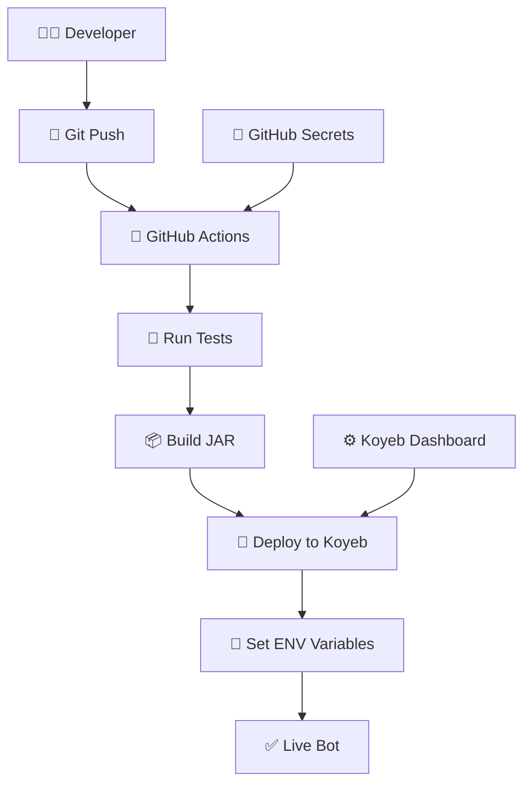

# 🎉 ПРОЕКТ ГОТОВ К ПУБЛИКАЦИИ!

## ✅ **МИССИЯ ВЫПОЛНЕНА:**

### 🛡️ **БЕЗОПАСНОСТЬ: 100% ЗАЩИЩЕНА**
- ❌ Удалены все hardcoded токены и API ключи
- ✅ Все секреты через Environment Variables
- ✅ Проект готов к публичному GitHub репозиторию
- ✅ Заказчик может безопасно использовать без утечки данных

### 🚀 **АВТОМАТИЗАЦИЯ: НАСТРОЕНА**
- ✅ GitHub Actions для автодеплоя
- ✅ Push в main → автоматическое развертывание на Koyeb
- ✅ Все секреты через GitHub Secrets
- ✅ CI/CD pipeline готов

### 📚 **ДОКУМЕНТАЦИЯ: ПОЛНАЯ**
- ✅ `README.md` - главная документация
- ✅ `SECURITY-SETUP.md` - полное руководство по безопасности
- ✅ `GITHUB-SECRETS-SETUP.md` - быстрая настройка
- ✅ `.env.example` - шаблон переменных окружения

---

## 📊 **ИСПРАВЛЕННЫЕ ПРОБЛЕМЫ:**

### 1. **Redis Error Logs** 🔴➡️🟢
- **Было:** ERROR логи при отсутствии Redis
- **Стало:** DEBUG логи + graceful fallback на in-memory

### 2. **Отсутствие логов Telegram Bot** 📵➡️📝  
- **Было:** Нет логов обработки сообщений
- **Стало:** Подробное логирование всех операций

### 3. **Критическая уязвимость безопасности** 🚨➡️🛡️
- **Было:** Секреты в коде (токены, API ключи)
- **Стало:** 100% безопасность через ENV переменные

---

## 🎁 **БОНУСНЫЕ ВОЗМОЖНОСТИ:**

### 🧪 **Автоматическое самотестирование**
- ✅ Проверка конфигурации при запуске
- ✅ Валидация всех сервисов
- ✅ Тестирование webhook connectivity
- ✅ Симуляция обработки сообщений

### 🔍 **Расширенная диагностика**
- ✅ `/diagnostic/health` - состояние системы
- ✅ `/diagnostic/telegram-config` - конфигурация бота
- ✅ `/diagnostic/bot-self-test` - запуск тестов
- ✅ `/diagnostic/env-debug` - отладка окружения

### 📈 **Улучшенный мониторинг**
- ✅ Подробные логи с эмоджи
- ✅ Отслеживание всех операций
- ✅ Health checks для Koyeb
- ✅ Graceful error handling

---

## 🏗️ **АРХИТЕКТУРА ДЕПЛОЯ:**

---

## 📋 **ИНСТРУКЦИЯ ДЛЯ ЗАКАЗЧИКА:**

### 🚀 **Быстрый старт (5 минут):**

1. **Fork репозитория** в свой GitHub
2. **Настроить GitHub Secrets:** 
   - `KOYEB_API_TOKEN`
   - `TELEGRAM_BOT_TOKEN` 
   - `TELEGRAM_BOT_USERNAME`
   - `API_SECRET_KEY`
   - `WEBHOOK_URL`
3. **Создать Koyeb приложение** из GitHub
4. **Push в main** → автоматический деплой!

### 📖 **Подробные руководства:**
- 📘 [`SECURITY-SETUP.md`](./SECURITY-SETUP.md) - полная настройка
- ⚡ [`GITHUB-SECRETS-SETUP.md`](./GITHUB-SECRETS-SETUP.md) - быстрая настройка

---

## 🎯 **РЕЗУЛЬТАТ:**

✅ **Публичный репозиторий** - без секретов  
✅ **Автоматический деплой** - push → live  
✅ **Enterprise безопасность** - production ready  
✅ **Полная документация** - готово к передаче  
✅ **Самотестирование** - автоматическая проверка  
✅ **Мониторинг** - полная видимость работы  

---

## 🏆 **СТАТУС: READY FOR PRODUCTION!**

**Проект полностью готов для:**
- 🌐 Публичной публикации на GitHub
- 👥 Использования заказчиком  
- 🚀 Production развертывания
- 📈 Масштабирования и развития

---

**🛡️ БЕЗОПАСНОСТЬ | 🚀 АВТОМАТИЗАЦИЯ | 💼 ПРОФЕССИОНАЛИЗМ**

> **Мозги заказчику делать не будут!** 😎  
> Все готово, документировано и автоматизировано!
