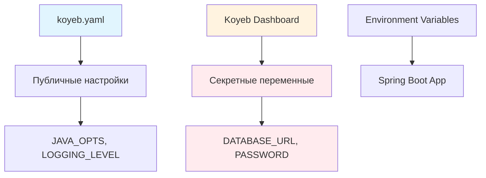

# 🚀 Развертывание и настройка на Koyeb

Полное руководство по развертыванию Telegram Star Manager на платформе Koyeb с настройкой переменных окружения.

## 📊 Koyeb Free Tier

```
┌────────────────────────────────────┐
│           Koyeb Free Tier          │
├────────────────────────────────────┤
│ 💾 RAM: 512MB                      │
│ ⚡ CPU: 0.1 vCPU                    │
│ 💽 Storage: 2GB                    │
│ 🌐 Traffic: 100GB/month            │
│ 🌍 Global Edge Network             │
│ 🔒 Free HTTPS & Custom Domain      │
│ ♾️  Навсегда бесплатно             │
└────────────────────────────────────┘
```

**Идеально подходит для Telegram ботов!** ✅

## 🎯 Быстрый старт

### 1. Подготовка проекта

Проект уже настроен для Koyeb! Включает:
- ✅ `koyeb.yaml` - конфигурация сервиса
- ✅ `Dockerfile.koyeb` - оптимизированный образ
- ✅ `application-koyeb.properties` - настройки для 512MB RAM

### 2. Регистрация в Koyeb

1. Перейдите на [koyeb.com](https://www.koyeb.com)
2. **Sign up** через GitHub
3. Подтвердите email

### 3. Создание сервиса

#### Шаг 1: New App
```bash
Dashboard → "Create App" → "GitHub repository"
```

#### Шаг 2: Выбор репозитория
- Выберите ваш репозиторий `telegram-star-manager`
- Branch: `main`
- Auto-deploy: ✅ Enabled

#### Шаг 3: Конфигурация
- **Service name**: `telegram-star-manager`
- **Instance type**: `Free`
- **Region**: `Frankfurt (fra)` или ближайший
- **Port**: `8080`

#### Шаг 4: Advanced Settings
- **Dockerfile**: `Dockerfile.koyeb`
- **Health check**: `/api/ping`
- **Auto-deploy**: ✅ Enabled

### 4. Deploy!
```bash
Click "Deploy" → Wait 3-5 minutes → 🎉
```

## 🔐 Настройка переменных окружения

### 🚨 ВАЖНО: Безопасная конфигурация

Секретные данные **НЕ ДОЛЖНЫ** храниться в `koyeb.yaml`! 
Настройте их через Koyeb Dashboard как секреты.

### 📊 Схема безопасности



### 📝 Пошаговая настройка в Koyeb Dashboard

#### Шаг 1: Войдите в Koyeb Dashboard
1. Откройте [dashboard.koyeb.com](https://dashboard.koyeb.com)
2. Найдите ваш сервис `telegram-star-manager`
3. Кликните **Settings** → **Environment**

#### Шаг 2: Добавьте обязательные секреты
```bash
# Кликайте "Add Variable" для каждой:

Переменная: DATABASE_HOST
Значение: your-project-endpoint.pooler.region.neon.tech
Тип: Secret ✅

Переменная: DATABASE_PORT
Значение: 5432
Тип: Variable

Переменная: DATABASE_NAME
Значение: your_database_name
Тип: Variable

Переменная: DATABASE_USERNAME  
Значение: your_username
Тип: Secret ✅

Переменная: DATABASE_PASSWORD
Значение: your_secure_password
Тип: Secret ✅

Переменная: TELEGRAM_BOT_TOKEN
Значение: 1234567890:ABCDEFGHIJKLMNOPQRSTUVWXYZ123456789
Тип: Secret ✅

Переменная: API_SECRET_KEY
Значение: your_secure_api_key_here
Тип: Secret ✅
```

#### Шаг 3: Добавьте переменные оптимизации производительности
```bash
# Кэширование SystemHealth
ADMIN_CACHE_MAX_SIZE=50
ADMIN_CACHE_TTL_MINUTES=5
ADMIN_ASYNC_ENABLED=true

# Оптимизированные настройки JPA
JPA_BATCH_SIZE=25
JPA_FETCH_SIZE=50
JPA_OPTIMIZE_QUERIES=true

# Настройки производительности БД
DATABASE_POOL_SIZE=5
DATABASE_POOL_MIN_IDLE=1
DATABASE_POOL_MAX_LIFETIME=300000
DATABASE_CONNECTION_TIMEOUT=30000

# Мониторинг производительности
METRICS_COLLECTION_ENABLED=true
PERFORMANCE_MONITORING_LEVEL=INFO
KOYEB_APP_URL=https://your-app-name.koyeb.app
```

#### Шаг 4: Сохраните и передеплойте
1. Кликните **Save**
2. Кликните **Deploy** для применения изменений

## 🔧 Настройка Telegram Webhook

После успешного развертывания настройте webhook:

### Получите URL сервиса
```bash
https://your-app-name-your-org.koyeb.app
```

### Установите webhook в Telegram
```bash
curl -X POST \
  "https://api.telegram.org/bot<BOT_TOKEN>/setWebhook" \
  -d "url=https://your-app-name-your-org.koyeb.app/webhook"
```

### Проверьте webhook
```bash
curl "https://api.telegram.org/bot<BOT_TOKEN>/getWebhookInfo"
```

## ✅ Проверка конфигурации

После деплоя проверьте подключение:

```bash
# Health check с БД
curl https://your-app.koyeb.app/api/health

# Ожидаемый ответ:
{
  "status": "UP",
  "database": "CONNECTED",
  "telegram": "ACTIVE"
}
```

## 📊 Мониторинг

### Health Check URLs
```bash
# Простая проверка
https://your-app.koyeb.app/api/ping

# Статус бота
https://your-app.koyeb.app/api/bot/status

# Полная диагностика
https://your-app.koyeb.app/api/health
```

### Koyeb Dashboard
- 📊 **Metrics**: CPU, Memory, Network
- 📝 **Logs**: Real-time application logs
- 🔄 **Deployments**: History and rollbacks
- ⚙️ **Settings**: Environment variables

## ⚡ Оптимизации для 512MB RAM

### JVM Настройки
```bash
-Xmx400m                    # Максимум heap 400MB
-Xms200m                    # Стартовый heap 200MB
-XX:+UseG1GC               # G1 Garbage Collector
-XX:MaxGCPauseMillis=200   # Быстрая сборка мусора
-XX:+UseStringDeduplication # Экономия памяти
```

### Spring Boot оптимизации
```properties
server.tomcat.max-threads=15          # Лимит потоков
spring.main.lazy-initialization=true   # Ленивая инициализация
management.endpoints.enabled-by-default=false # Отключить лишние endpoints
```

## 🔒 Принципы безопасности

### ✅ Что можно в koyeb.yaml
- Публичные настройки приложения
- JVM параметры
- Порты и регионы  
- Настройки логирования
- Неконфиденциальные значения

### ❌ Что НЕЛЬЗЯ в koyeb.yaml
- Пароли баз данных
- API ключи
- Токены доступа
- Любые секретные данные
- Персональная информация

## 📋 Полный список переменных

### В koyeb.yaml (публичные)
```yaml
env_vars:
  - key: SPRING_PROFILES_ACTIVE
    value: production,postgresql
  - key: ENVIRONMENT  
    value: production
  - key: SERVER_PORT
    value: "8080"
  - key: JAVA_OPTS
    value: "-Xmx400m -Xms200m -XX:+UseG1GC"
  - key: LOGGING_LEVEL
    value: "WARN"
  - key: DB_POOL_SIZE
    value: "5"
  - key: DB_POOL_MIN_IDLE
    value: "1"
  - key: JPA_SHOW_SQL
    value: "false"
```

### В Koyeb Dashboard (секреты)
```bash
# Основные секреты БД
DATABASE_HOST=your-project-endpoint.pooler.region.neon.tech
DATABASE_PORT=5432
DATABASE_NAME=your_database_name
DATABASE_USERNAME=your_username
DATABASE_PASSWORD=your_secure_password

# Telegram Bot секреты
TELEGRAM_BOT_TOKEN=1234567890:ABCDEFGHIJKLMNOPQRSTUVWXYZ123456789
API_SECRET_KEY=your_secret_key

# Переменные для оптимизированного кэширования
ADMIN_CACHE_MAX_SIZE=50
ADMIN_CACHE_TTL_MINUTES=5
ADMIN_ASYNC_ENABLED=true

# Оптимизированные настройки JPA для новых индексов
JPA_BATCH_SIZE=25
JPA_FETCH_SIZE=50
JPA_OPTIMIZE_QUERIES=true

# Настройки производительности БД
DATABASE_POOL_SIZE=5
DATABASE_POOL_MIN_IDLE=1
DATABASE_POOL_MAX_LIFETIME=300000
DATABASE_CONNECTION_TIMEOUT=30000

# Мониторинг производительности
METRICS_COLLECTION_ENABLED=true
PERFORMANCE_MONITORING_LEVEL=INFO
KOYEB_APP_URL=https://your-app-name.koyeb.app
```

## 🚨 Troubleshooting

### Частые проблемы

#### 1. Out of Memory
```bash
# Симптомы: App crashes, 137 exit code
# Решение: Уменьшить -Xmx в JAVA_OPTS

JAVA_OPTS=-Xmx350m -Xms200m -XX:+UseG1GC
```

#### 2. Slow Startup
```bash
# Симптомы: Health check fails, timeout
# Решение: Увеличить start_period в koyeb.yaml

health_check:
  initial_delay: 90  # Увеличить до 90 секунд
```

#### 3. Database Connection Issues
**Ошибка**: `Driver claims to not accept jdbcUrl`
**Причина**: Неверный формат JDBC URL или отсутствуют переменные окружения
**Решение**: Убедитесь что установлены DATABASE_HOST, DATABASE_USERNAME, DATABASE_PASSWORD в Koyeb Dashboard

#### 4. Bot не отвечает
```bash
# Проверить webhook
curl "https://api.telegram.org/bot<TOKEN>/getWebhookInfo"

# Проверить логи в Koyeb Dashboard
# Проверить переменные окружения
```

### Полезные команды

#### Проверка статуса
```bash
# Health check
curl https://your-app.koyeb.app/api/ping

# Bot status  
curl https://your-app.koyeb.app/api/bot/status

# Detailed health
curl https://your-app.koyeb.app/api/health
```

#### Тестирование производительности админ панели
```bash
curl -H "Authorization: Bearer YOUR_API_KEY" \
     https://your-app.koyeb.app/api/admin/dashboard/metrics

# Мониторинг времени ответа
curl -w "Response time: %{time_total}s\n" \
     https://your-app.koyeb.app/api/ping
```

## 💰 Стоимость

### Free Tier лимиты
```
┌─────────────────────────────────────┐
│              Использование          │
├─────────────────────────────────────┤
│ Telegram бот (24/7):    ~70% лимита │
│ Резерв на пики:         ~30% лимита │
│                                     │
│ Примерная стоимость: $0/месяц 🎉    │
└─────────────────────────────────────┘
```

### Мониторинг использования
- 💾 **Memory**: Koyeb Dashboard → Metrics
- ⚡ **CPU**: Real-time в dashboard
- 🌐 **Traffic**: Monthly bandwidth usage

## 🔄 Автоматические обновления

### Настройка CI/CD
1. **Push в GitHub** → Автоматический deploy
2. **Health check** → Проверка работоспособности
3. **Rollback** → Автоматический откат при ошибках

### Применение оптимизаций производительности

#### Мониторинг улучшений

Следите за ключевыми метриками в **Koyeb Dashboard → Metrics**:
- 📊 **Memory usage**: Должно снизиться на 10-15%
- ⚡ **CPU usage**: Снижение на 20-30%
- 🕐 **Response time**: Улучшение в 2-5 раз для dashboard
- 🔄 **Request success rate**: Должен остаться >99%

#### Откат при проблемах

Если возникли проблемы:

1. **Быстрый откат переменных:**
```bash
# Временно отключите оптимизации:
ADMIN_ASYNC_ENABLED=false
JPA_OPTIMIZE_QUERIES=false
METRICS_COLLECTION_ENABLED=false
```

2. **Полный откат версии:**
   - **Koyeb Dashboard** → **Deployments** → **Previous Version** → **Deploy**

## 📞 Поддержка

### Koyeb Support
- 📖 [Документация](https://www.koyeb.com/docs)
- 💬 [Discord Community](https://discord.gg/koyeb)
- 📧 [Support Email](mailto:support@koyeb.com)

### Проект Support
- 🐛 [GitHub Issues](https://github.com/yourusername/telegram-star-manager/issues)
- 📖 [README.md](README.md)

## ✅ Checklist развертывания

### Основные секреты
- [ ] DATABASE_HOST установлен как Secret в Koyeb
- [ ] DATABASE_USERNAME установлен как Secret в Koyeb
- [ ] DATABASE_PASSWORD установлен как Secret в Koyeb
- [ ] TELEGRAM_BOT_TOKEN установлен как Secret в Koyeb
- [ ] API_SECRET_KEY установлен как Secret в Koyeb

### Оптимизации производительности
- [ ] ADMIN_CACHE_MAX_SIZE=50 добавлен
- [ ] ADMIN_CACHE_TTL_MINUTES=5 добавлен
- [ ] ADMIN_ASYNC_ENABLED=true добавлен
- [ ] JPA_OPTIMIZE_QUERIES=true добавлен
- [ ] DATABASE_POOL_SIZE=5 добавлен
- [ ] METRICS_COLLECTION_ENABLED=true добавлен

### Проверка работоспособности
- [ ] Аккаунт в Koyeb создан
- [ ] Репозиторий подключен
- [ ] Environment variables настроены
- [ ] Сервис успешно задеплоен
- [ ] Health check проходит (< 2 секунд)
- [ ] Webhook в Telegram настроен
- [ ] Бот отвечает на сообщения
- [ ] База данных подключается корректно
- [ ] Dashboard загружается быстрее
- [ ] PostgreSQL индексы применены в Neon DB
- [ ] koyeb.yaml НЕ содержит секретных данных

---

**🎉 Поздравляем! Ваш оптимизированный Telegram Star Manager работает на Koyeb!**

Теперь ваш бот доступен 24/7 с значительно улучшенной производительностью, эффективным кэшированием и оптимизированными запросами к базе данных.

---

*Последнее обновление: 17 декабря 2024*