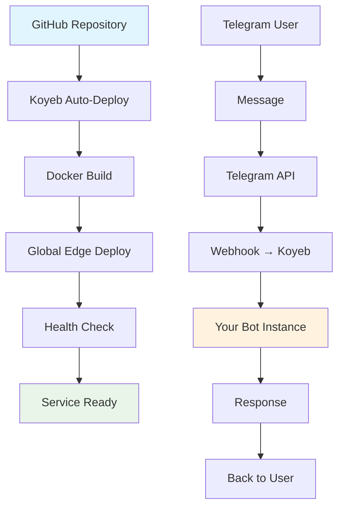

# 🚀 Развертывание на Koyeb

Пошаговое руководство по развертыванию Telegram Star Manager на платформе Koyeb.

## 📊 Koyeb Free Tier

```
┌────────────────────────────────────┐
│           Koyeb Free Tier          │
├────────────────────────────────────┤
│ 💾 RAM: 512MB                      │
│ ⚡ CPU: 0.1 vCPU                    │
│ 💽 Storage: 2GB                    │
│ 🌐 Traffic: 100GB/month            │
│ 🌍 Global Edge Network             │
│ 🔒 Free HTTPS & Custom Domain      │
│ ♾️  Навсегда бесплатно             │
└────────────────────────────────────┘
```

**Идеально подходит для Telegram ботов!** ✅

## 🎯 Быстрый старт

### 1. Подготовка проекта

Проект уже настроен для Koyeb! Включает:
- ✅ `koyeb.yaml` - конфигурация сервиса
- ✅ `Dockerfile.koyeb` - оптимизированный образ
- ✅ `application-koyeb.properties` - настройки для 512MB RAM
- ✅ `.env.koyeb` - шаблон переменных окружения

### 2. Регистрация в Koyeb

1. Перейдите на [koyeb.com](https://www.koyeb.com)
2. **Sign up** через GitHub
3. Подтвердите email

### 3. Создание сервиса

#### Шаг 1: New App
```bash
Dashboard → "Create App" → "GitHub repository"
```

#### Шаг 2: Выбор репозитория
- Выберите ваш репозиторий `telegram-star-manager`
- Branch: `main`
- Auto-deploy: ✅ Enabled

#### Шаг 3: Конфигурация
- **Service name**: `telegram-star-manager`
- **Instance type**: `Free`
- **Region**: `Frankfurt (fra)` или ближайший
- **Port**: `8080`

#### Шаг 4: Environment Variables
```bash
TELEGRAM_BOT_TOKEN=ваш_токен_от_botfather
TELEGRAM_BOT_USERNAME=ваш_бот_username
API_KEY=ваш_безопасный_api_ключ
API_SECRET_KEY=ваш_безопасный_api_ключ
ENVIRONMENT=production
SERVER_PORT=8080
LOGGING_LEVEL=WARN
```

#### Шаг 5: Advanced Settings
- **Dockerfile**: `Dockerfile.koyeb`
- **Health check**: `/api/ping`
- **Auto-deploy**: ✅ Enabled

### 4. Deploy!
```bash
Click "Deploy" → Wait 3-5 minutes → 🎉
```

## 🔧 Настройка Telegram Webhook

После успешного развертывания настройте webhook:

### Получите URL сервиса
```bash
https://your-app-name-your-org.koyeb.app
```

### Установите webhook в Telegram
```bash
curl -X POST \
  "https://api.telegram.org/bot<BOT_TOKEN>/setWebhook" \
  -d "url=https://your-app-name-your-org.koyeb.app/webhook"
```

### Проверьте webhook
```bash
curl "https://api.telegram.org/bot<BOT_TOKEN>/getWebhookInfo"
```

## 📊 Мониторинг

### Health Check URLs
```bash
# Простая проверка
https://your-app.koyeb.app/api/ping

# Статус бота
https://your-app.koyeb.app/api/bot/status

# Полная диагностика
https://your-app.koyeb.app/api/health
```

### Koyeb Dashboard
- 📊 **Metrics**: CPU, Memory, Network
- 📝 **Logs**: Real-time application logs
- 🔄 **Deployments**: History and rollbacks
- ⚙️ **Settings**: Environment variables

## 🎨 Архитектура развертывания



## ⚡ Оптимизации для 512MB RAM

### JVM Настройки
```bash
-Xmx400m                    # Максимум heap 400MB
-Xms200m                    # Стартовый heap 200MB
-XX:+UseG1GC               # G1 Garbage Collector
-XX:MaxGCPauseMillis=200   # Быстрая сборка мусора
-XX:+UseStringDeduplication # Экономия памяти
```

### Spring Boot оптимизации
```properties
server.tomcat.max-threads=15          # Лимит потоков
spring.main.lazy-initialization=true   # Ленивая инициализация
management.endpoints.enabled-by-default=false # Отключить лишние endpoints
```

### Логирование
```properties
logging.level.org.springframework=WARN  # Меньше логов
logging.level.org.hibernate=WARN        # Меньше Hibernate логов
```

## 🚨 Troubleshooting

### Частые проблемы

#### 1. Out of Memory
```bash
# Симптомы: App crashes, 137 exit code
# Решение: Уменьшить -Xmx в JAVA_OPTS

JAVA_OPTS=-Xmx350m -Xms200m -XX:+UseG1GC
```

#### 2. Slow Startup
```bash
# Симптомы: Health check fails, timeout
# Решение: Увеличить start_period в koyeb.yaml

health_check:
  initial_delay: 90  # Увеличить до 90 секунд
```

#### 3. Bot не отвечает
```bash
# Проверить webhook
curl "https://api.telegram.org/bot<TOKEN>/getWebhookInfo"

# Проверить логи в Koyeb Dashboard
# Проверить переменные окружения
```

#### 4. Build fails
```bash
# Симптомы: Docker build error
# Решение: Проверить Dockerfile.koyeb

# Убедиться что target/ содержит JAR файл
# Локально: ./mvnw clean package -DskipTests
```

### Полезные команды

#### Проверка статуса
```bash
# Health check
curl https://your-app.koyeb.app/api/ping

# Bot status  
curl https://your-app.koyeb.app/api/bot/status

# Detailed health
curl https://your-app.koyeb.app/api/health
```

#### Отправка тестового сообщения
```bash
curl -X POST https://your-app.koyeb.app/api/bot/send-message \
  -d "chatId=YOUR_CHAT_ID&message=Test from Koyeb!"
```

## 💰 Стоимость

### Free Tier лимиты
```
┌─────────────────────────────────────┐
│              Использование          │
├─────────────────────────────────────┤
│ Telegram бот (24/7):    ~70% лимита │
│ Резерв на пики:         ~30% лимита │
│                                     │
│ Примерная стоимость: $0/месяц 🎉    │
└─────────────────────────────────────┘
```

### Мониторинг использования
- 💾 **Memory**: Koyeb Dashboard → Metrics
- ⚡ **CPU**: Real-time в dashboard
- 🌐 **Traffic**: Monthly bandwidth usage

## 🔄 Автоматические обновления

### Настройка CI/CD
1. **Push в GitHub** → Автоматический deploy
2. **Health check** → Проверка работоспособности
3. **Rollback** → Автоматический откат при ошибках

### Настройка branch protection
```bash
# В GitHub Settings → Branches
# Protect main branch
# Require status checks: Koyeb deploy
```

## 📞 Поддержка

### Koyeb Support
- 📖 [Документация](https://www.koyeb.com/docs)
- 💬 [Discord Community](https://discord.gg/koyeb)
- 📧 [Support Email](mailto:support@koyeb.com)

### Проект Support
- 🐛 [GitHub Issues](https://github.com/yourusername/telegram-star-manager/issues)
- 📖 [README.md](README.md)

---

## ✅ Checklist развертывания

- [ ] Аккаунт в Koyeb создан
- [ ] Репозиторий подключен
- [ ] Environment variables настроены
- [ ] Сервис успешно задеплоен
- [ ] Health check проходит
- [ ] Webhook в Telegram настроен
- [ ] Бот отвечает на сообщения
- [ ] Мониторинг настроен

**🎉 Поздравляем! Ваш Telegram Star Manager работает на Koyeb!** 

Теперь ваш бот доступен 24/7 с автоматическим масштабированием и глобальной сетью доставки контента.
