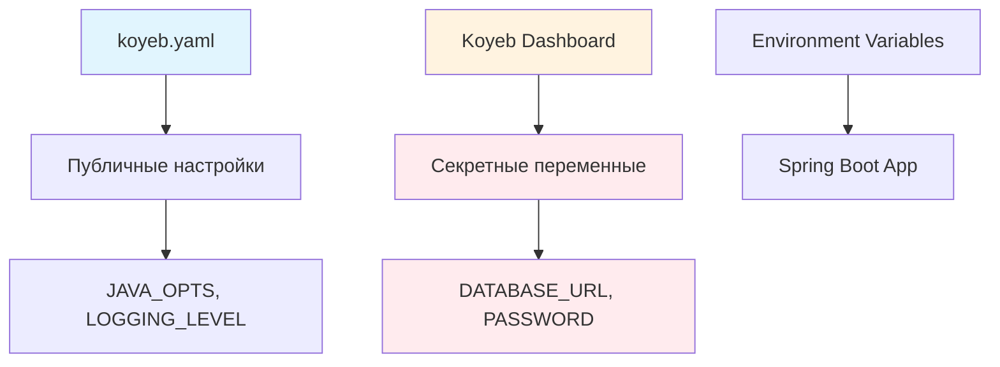
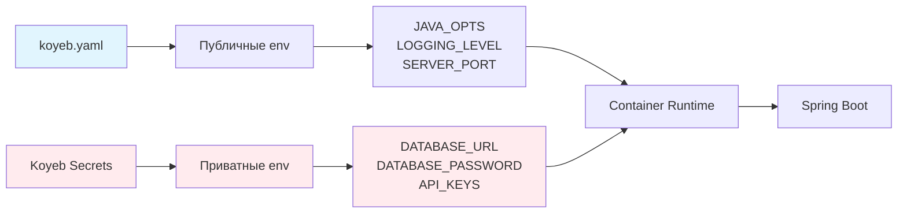

# 🔐 Настройка переменных окружения Koyeb

## 🚨 ВАЖНО: Безопасная конфигурация базы данных

Учетные данные базы данных **НЕ ДОЛЖНЫ** храниться в `koyeb.yaml`! 
Настройте их через Koyeb Dashboard как секреты.

## 📊 Схема безопасности



## 🔑 Переменные для настройки в Koyeb Dashboard

### Обязательные секреты (DATABASE)
```bash
DATABASE_HOST=your-project-endpoint.pooler.region.neon.tech
DATABASE_PORT=5432
DATABASE_NAME=your_database_name
DATABASE_USERNAME=your_username
DATABASE_PASSWORD=your_secure_password
```

### Опциональные API ключи
```bash
API_KEY=your_secure_api_key_here
API_SECRET_KEY=your_secure_secret_key_here
```

## 📝 Пошаговая настройка в Koyeb

### Шаг 1: Войдите в Koyeb Dashboard
1. Откройте [dashboard.koyeb.com](https://dashboard.koyeb.com)
2. Найдите ваш сервис `telegram-star-manager`
3. Кликните **Settings** → **Environment**

### Шаг 2: Добавьте переменные БД
```bash
# Кликайте "Add Variable" для каждой:

Переменная: DATABASE_HOST
Значение: your-project-endpoint.pooler.region.neon.tech
Тип: Secret ✅

Переменная: DATABASE_PORT
Значение: 5432
Тип: Variable

Переменная: DATABASE_NAME
Значение: your_database_name
Тип: Variable

Переменная: DATABASE_USERNAME  
Значение: your_username
Тип: Secret ✅

Переменная: DATABASE_PASSWORD
Значение: your_secure_password
Тип: Secret ✅

Переменная: TELEGRAM_BOT_TOKEN
Значение: 1234567890:ABCDEFGHIJKLMNOPQRSTUVWXYZ123456789
Тип: Secret ✅
```

### Шаг 3: Сохраните и передеплойте
1. Кликните **Save**
2. Кликните **Deploy** для применения изменений

## ✅ Проверка конфигурации

После деплоя проверьте подключение к БД:

```bash
# Health check с БД
curl https://your-app.koyeb.app/api/health

# Ожидаемый ответ:
{
  "status": "UP",
  "database": "CONNECTED",
  "telegram": "ACTIVE"
}
```

## 🎯 Архитектура переменных



## 🔒 Принципы безопасности

### ✅ Что можно в koyeb.yaml
- Публичные настройки приложения
- JVM параметры
- Порты и регионы  
- Настройки логирования
- Неконфиденциальные значения

### ❌ Что НЕЛЬЗЯ в koyeb.yaml
- Пароли баз данных
- API ключи
- Токены доступа
- Любые секретные данные
- Персональная информация

## 📋 Полный список переменных

### В koyeb.yaml (публичные)
```yaml
env_vars:
  - key: SPRING_PROFILES_ACTIVE
    value: production,postgresql
  - key: ENVIRONMENT  
    value: production
  - key: SERVER_PORT
    value: "8080"
  - key: JAVA_OPTS
    value: "-Xmx400m -Xms200m -XX:+UseG1GC"
  - key: LOGGING_LEVEL
    value: "WARN"
  - key: DB_POOL_SIZE
    value: "5"
  - key: DB_POOL_MIN_IDLE
    value: "1"
  - key: JPA_SHOW_SQL
    value: "false"
```

### В Koyeb Dashboard (секреты)
```bash
DATABASE_HOST=your-project-endpoint.pooler.region.neon.tech
DATABASE_PORT=5432
DATABASE_NAME=your_database_name
DATABASE_USERNAME=your_username
DATABASE_PASSWORD=your_secure_password
TELEGRAM_BOT_TOKEN=1234567890:ABCDEFGHIJKLMNOPQRSTUVWXYZ123456789
API_KEY=your_api_key
API_SECRET_KEY=your_secret_key
```

## 🚨 Troubleshooting

### Ошибка: `Driver claims to not accept jdbcUrl`
**Причина**: Неверный формат JDBC URL или отсутствуют переменные окружения
**Решение**: Убедитесь что установлены DATABASE_HOST, DATABASE_USERNAME, DATABASE_PASSWORD в Koyeb Dashboard

### Ошибка: Connection refused
**Причина**: Неверные учетные данные или недоступен хост БД
**Решение**: Проверьте DATABASE_HOST, DATABASE_USERNAME, DATABASE_PASSWORD в Koyeb Dashboard

### Ошибка: SSL connection failed
**Причина**: Проблемы с SSL подключением к Neon
**Решение**: Убедитесь что в JDBC URL присутствует `?sslmode=require&prepareThreshold=0`

### Ошибка: Application startup timeout
**Причина**: Приложение не может подключиться к БД при старте
**Решение**: Увеличьте initial_delay в health_check до 90 секунд в koyeb.yaml

## 📞 Поддержка

### Получить новые учетные данные Neon
```bash
# Используйте MCP сервер Neon или:
# 1. Войдите в Neon Console
# 2. Project → Settings → General
# 3. Connection Details → Generate new password
```

### Изменить переменные в Koyeb
```bash
# 1. Dashboard → Service → Settings → Environment  
# 2. Найдите переменную → Edit
# 3. Обновите значение → Save → Deploy
```

---

## ✅ Checklist безопасности

- [ ] DATABASE_HOST установлен как Secret в Koyeb
- [ ] DATABASE_USERNAME установлен как Secret в Koyeb
- [ ] DATABASE_PASSWORD установлен как Secret в Koyeb  
- [ ] TELEGRAM_BOT_TOKEN установлен как Secret в Koyeb
- [ ] koyeb.yaml НЕ содержит секретных данных
- [ ] Переменные правильно применились после деплоя
- [ ] Health check проходит успешно
- [ ] База данных подключается корректно

**🎉 Безопасная конфигурация готова!**
