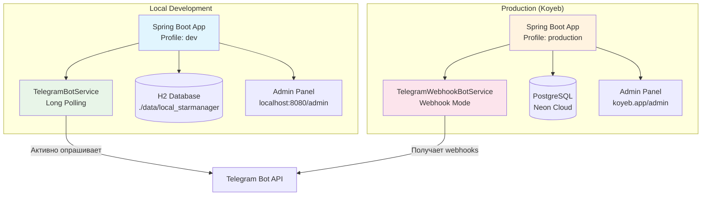

# 🚀 Настройка локальной разработки Telegram Star Manager

## 📋 Быстрый старт

### 1. 🔧 Подготовка окружения

```bash
# 1. Скопируйте файл переменных окружения
cp .env.example .env

# 2. Отредактируйте .env файл и укажите токен вашего бота
# TELEGRAM_BOT_TOKEN=ВАШ_РЕАЛЬНЫЙ_ТОКЕН_БОТА
```

### 2. 🎯 Конфигурация IntelliJ IDEA

#### Вариант A: Использование профиля dev (Рекомендуется)
```
Run Configuration:
- Main class: shit.back.TelegramStarManagerApplication
- VM options: -Dspring.profiles.active=dev
- Environment variables: (загрузятся из .env файла)
```

#### Вариант B: Использование Environment Variables в IDE
```
Environment Variables в Run Configuration:
SPRING_PROFILES_ACTIVE=dev
TELEGRAM_BOT_TOKEN=ваш_токен
TELEGRAM_BOT_USERNAME=MirzaShop_bot
API_SECRET_KEY=dev-secret-key-12345
H2_CONSOLE_ENABLED=true
```

### 3. ▶️ Запуск приложения

1. Открыйте проект в IntelliJ IDEA
2. Найдите `TelegramStarManagerApplication.java`
3. Нажмите **Run** (зеленая стрелка)
4. Дождитесь успешного запуска

## 🎯 Что проверить после запуска

### ✅ Логи приложения
```
🤖 Initializing Telegram Bot Service...
✅ Telegram bot 'MirzaShop_bot' registered successfully!
🚀 Telegram Bot Service initialization completed. Status: Active and registered
```

### ✅ Доступные URL-адреса
- **Admin Panel**: http://localhost:8080/admin
- **Activity Logs**: http://localhost:8080/admin/activity-logs
- **Feature Flags**: http://localhost:8080/admin/feature-flags  
- **Monitoring**: http://localhost:8080/admin/monitoring
- **H2 Database Console**: http://localhost:8080/h2-console
- **Health Check**: http://localhost:8080/actuator/health

### ✅ H2 Database Console
```
URL: http://localhost:8080/h2-console
JDBC URL: jdbc:h2:file:./data/local_starmanager
User Name: sa
Password: (оставить пустым)
```

## 🔄 Различия между локальной и продакшн-версией

### 📊 Сравнительная таблица

| Параметр | Локальная разработка | Продакшн (Koyeb) |
|----------|---------------------|------------------|
| **Профиль** | `dev` | `production` |
| **Bot Service** | `TelegramBotService` (Polling) | `TelegramWebhookBotService` (Webhook) |
| **База данных** | H2 (встроенная) | PostgreSQL (Neon) |
| **URL** | http://localhost:8080 | https://brave-selina-g45-16b60ff3.koyeb.app |
| **Bot режим** | Long Polling | Webhook |
| **Логирование** | DEBUG (подробно) | INFO (минимально) |
| **H2 Console** | Включена | Отключена |

### 🔄 Архитектура переключения



## 🐛 Решение проблем

### ❌ Проблема: Bot token not configured
```
⚠️ Bot token not configured! Please set telegram.bot.token
```
**Решение**: Проверьте .env файл или переменные окружения в IDE.

### ❌ Проблема: Не запускается H2 Console
```
Whitelabel Error Page
```
**Решение**: Убедитесь, что `H2_CONSOLE_ENABLED=true` в .env файле.

### ❌ Проблема: 404 на /admin/activity-logs
```
404 Not Found
```
**Решение**: Этот баг уже исправлен. Проверьте, что используете профиль `dev`.

### ❌ Проблема: Ошибка подключения к базе данных
```
SQLException: Database may be already in use
```
**Решение**: Закройте все подключения к H2 и перезапустите приложение.

## 🧪 Тестирование

### 1. 🤖 Тестирование бота
1. Найдите своего бота в Telegram: @MirzaShop_bot
2. Отправьте команду `/start`
3. Проверьте логи в IntelliJ на получение сообщения

### 2. 🔧 Тестирование админки
1. Откройте http://localhost:8080/admin
2. Проверьте все страницы:
   - Dashboard
   - Activity Logs (недавно исправлено)
   - Feature Flags  
   - Monitoring

### 3. 🗄️ Тестирование базы данных
1. Откройте http://localhost:8080/h2-console
2. Выполните запрос: `SELECT * FROM user_activity_log`
3. Проверьте создание таблиц

## 📝 Полезные команды

### Maven команды
```bash
# Компиляция проекта
mvn clean compile

# Запуск тестов
mvn test

# Создание JAR файла
mvn clean package

# Запуск приложения через Maven
mvn spring-boot:run -Dspring-boot.run.profiles=dev
```

### Команды для отладки
```bash
# Проверить переменные окружения
echo $SPRING_PROFILES_ACTIVE

# Проверить состояние приложения
curl http://localhost:8080/actuator/health

# Проверить конфигурацию
curl http://localhost:8080/actuator/env
```

## 🎯 Следующие шаги

После успешного запуска:

1. **Протестируйте бота** в Telegram
2. **Изучите админку** по всем разделам
3. **Проверьте логи активности** в H2 Console
4. **Настройте Feature Flags** через админку
5. **Мониторьте производительность** в разделе Monitoring

## 📚 Дополнительные ресурсы

- **Admin Panel Fix**: `ADMIN_404_FIX.md`
- **Production Setup**: `KOYEB_DEPLOYMENT.md`
- **Security Setup**: `SECURITY-SETUP.md`
- **Complete Documentation**: `DOCUMENTATION_INDEX.md`

---

💡 **Совет**: Сохраните эти инструкции и используйте их каждый раз при настройке нового окружения разработки.
