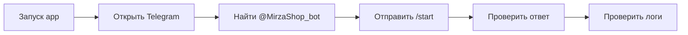
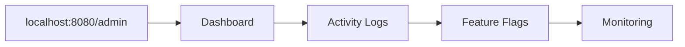
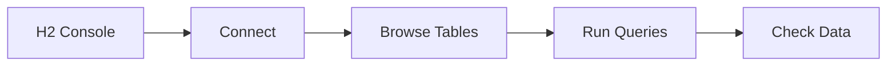

# ✅ Настройка локальной разработки завершена!

## 🎉 Что было создано

### 📝 Конфигурационные файлы
- ✅ `src/main/resources/application-dev.properties` - Профиль для разработки
- ✅ `.env.example` - Шаблон переменных окружения
- ✅ `.idea/runConfigurations/TelegramStarManager_Local.xml` - Run Configuration для IntelliJ

### 📚 Документация
- ✅ `LOCAL_DEVELOPMENT_SETUP.md` - Подробное руководство по настройке
- ✅ `QUICK_START_GUIDE.md` - Быстрый старт за 3 минуты
- ✅ `LOCAL_TESTING_ARCHITECTURE.md` - Архитектура и диаграммы

### ⚙️ Настройки проекта
- ✅ Обновлен `.gitignore` для локальной разработки
- ✅ Настроена H2 база данных для тестирования
- ✅ Сконфигурирован Long Polling режим для бота

---

## 🚀 Быстрый старт (прямо сейчас!)

### 1. Настройте токен бота (30 секунд)
```bash
cp .env.example .env
# Отредактируйте .env и укажите TELEGRAM_BOT_TOKEN
```

### 2. Запустите в IntelliJ IDEA (30 секунд)
1. Найдите Run Configuration: **"TelegramStarManager Local"**
2. Нажмите Run ▶️

### 3. Проверьте работу (1 минута)
- 🌐 **Admin Panel**: http://localhost:8080/admin
- 🗄️ **H2 Console**: http://localhost:8080/h2-console
- 🤖 **Bot Test**: Отправьте `/start` в @MirzaShop_bot

---

## 📋 Что работает в локальном режиме

### ✅ Telegram Bot
- **Режим**: Long Polling (без webhook)
- **Сервис**: `TelegramBotService` 
- **Профиль**: `@Profile("!production")`
- **Логирование**: Подробное (DEBUG)

### ✅ Admin Panel (Все исправлено!)
- **Dashboard**: http://localhost:8080/admin/dashboard
- **Activity Logs**: http://localhost:8080/admin/activity-logs ✅
- **Feature Flags**: http://localhost:8080/admin/feature-flags ✅
- **Monitoring**: http://localhost:8080/admin/monitoring ✅

### ✅ Database
- **Тип**: H2 (встроенная)
- **Файл**: `./data/local_starmanager.mv.db`
- **Console**: http://localhost:8080/h2-console
- **Схема**: Создается автоматически

### ✅ Configuration
- **Профиль**: `dev`
- **Порт**: `8080`
- **Конфиг**: `application-dev.properties`
- **Переменные**: `.env` файл

---

## 🔄 Архитектурные различия

| Компонент | Локальная разработка | Продакшн (Koyeb) |
|-----------|---------------------|------------------|
| **Bot Service** | `TelegramBotService` | `TelegramWebhookBotService` |
| **Bot Mode** | Long Polling | Webhook |
| **Database** | H2 (file) | PostgreSQL (cloud) |
| **Profile** | `dev` | `production` |
| **URL** | localhost:8080 | koyeb.app |
| **Logging** | DEBUG | INFO |
| **H2 Console** | Enabled | Disabled |

---

## 🧪 Сценарии тестирования

### 1. 🤖 Тест бота


### 2. 🔧 Тест админки


### 3. 🗄️ Тест базы данных


---

## 🐛 Troubleshooting

### Проблема: Bot не запускается
```bash
# Проверка токена
grep TELEGRAM_BOT_TOKEN .env

# Проверка профиля
echo $SPRING_PROFILES_ACTIVE
```

### Проблема: 404 на admin страницах
```
Решение: Убедитесь что используется профиль 'dev'
VM options: -Dspring.profiles.active=dev
```

### Проблема: H2 Console не работает
```
Решение: Проверьте настройку H2_CONSOLE_ENABLED=true
```

---

## 📊 Мониторинг работы

### Логи успешного запуска:
```
🤖 Initializing Telegram Bot Service...
✅ Telegram bot 'MirzaShop_bot' registered successfully!
🚀 Telegram Bot Service initialization completed. Status: Active and registered
🗄️ H2 Console available at: http://localhost:8080/h2-console
🌐 Admin Panel available at: http://localhost:8080/admin
```

### Ключевые endpoints для проверки:
- **Health**: http://localhost:8080/actuator/health
- **Info**: http://localhost:8080/actuator/info
- **Metrics**: http://localhost:8080/actuator/metrics

---

## 🎯 Следующие шаги

После успешного запуска:

1. **🤖 Протестируйте бота** - отправьте сообщения и проверьте ответы
2. **🔧 Изучите админку** - пройдитесь по всем разделам
3. **🗄️ Исследуйте H2 Console** - посмотрите на структуру БД
4. **📊 Мониторьте логи** - следите за активностью в IntelliJ
5. **⚙️ Настройте Feature Flags** - поэкспериментируйте с функциями

---

## 🏆 Итоги настройки

### ✅ Что достигнуто:
- 🔧 **Полностью рабочая локальная среда разработки**
- 🤖 **Бот в режиме Long Polling для тестирования**
- 🗄️ **H2 база данных с консолью для отладки**
- 🌐 **Исправленная админка со всеми функциями**
- 📝 **Полная документация и инструкции**
- ⚙️ **Готовые конфигурации для IntelliJ IDEA**

### 🎯 Преимущества локальной разработки:
- ⚡ **Быстрый запуск** - одна кнопка в IDE
- 🔄 **Автоматическая перезагрузка** при изменениях
- 🐛 **Подробные логи** для отладки
- 💾 **Локальная база данных** для экспериментов
- 🔗 **Прямой доступ к админке** без HTTPS

---

## 📚 Полная документация

| Документ | Назначение |
|----------|------------|
| `QUICK_START_GUIDE.md` | Быстрый запуск за 3 минуты |
| `LOCAL_DEVELOPMENT_SETUP.md` | Подробное руководство |
| `LOCAL_TESTING_ARCHITECTURE.md` | Архитектура и диаграммы |
| `.env.example` | Шаблон переменных окружения |
| `application-dev.properties` | Конфигурация для разработки |

---

## 🎉 Готово к использованию!

Ваша локальная среда разработки полностью настроена и готова к использованию. 

**Просто запустите "Run" в IntelliJ IDEA и начинайте разрабатывать! 🚀**

---

💡 **Помните**: Все исправления админки (включая 404 ошибки) уже применены и работают в локальной среде. Продакшн-версия также успешно развернута на Koyeb.
