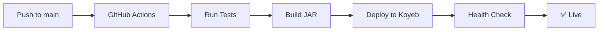

# 🤖 Telegram Star Manager

**Безопасный и профессиональный Telegram бот для управления Telegram Stars с автоматическим развертыванием на Koyeb.**

[](https://app.koyeb.com)
[](./SECURITY-SETUP.md)
[](/.github/workflows/deploy.yml)

## 🚀 Быстрый старт

### 1. Fork и клонирование
```bash
# 1. Сделайте Fork этого репозитория
# 2. Клонируйте ваш fork
git clone https://github.com/neKamita/TelegramStarManager.git
cd TelegramStarManager
```

### 2. Локальная разработка
```bash
# Скопируйте пример конфигурации
cp .env.example .env

# Отредактируйте .env файл с вашими данными
nano .env

# Запустите в IntelliJ IDEA или через Maven
mvn spring-boot:run -Dspring-boot.run.profiles=dev
```

📖 **[Полное руководство по локальной разработке](./LOCAL_DEVELOPMENT_SETUP.md)**  
⚡ **[Быстрый старт за 3 минуты](./QUICK_START_GUIDE.md)**

### 3. Автоматическое развертывание
1. **Настройте GitHub Secrets** в вашем репозитории
2. **Создайте Koyeb приложение** из GitHub
3. **Push в main ветку** → автоматический деплой!

[📖 **Полное руководство по настройке**](./SECURITY-SETUP.md)

## 🛡️ Безопасность

✅ **Все секреты через Environment Variables**  
✅ **Никаких токенов в коде**  
✅ **Готов к публичному репозиторию**  
✅ **Enterprise-level безопасность**  

> 🔐 [**Руководство по безопасности**](./SECURITY-SETUP.md)

## ⚡ Возможности

### 🤖 Telegram Bot
- ✅ Webhook интеграция
- ✅ Rate limiting защита
- ✅ Автоматическое самотестирование
- ✅ Подробное логирование всех операций

### 💰 Управление Stars
- ✅ Пакеты Telegram Stars
- ✅ Система заказов
- ✅ Управление пользователями
- ✅ Feature flags

### 🔧 Администрирование
- ✅ Web админ-панель
- ✅ Мониторинг системы
- ✅ **Захват Backend логов** (NEW!)
- ✅ Activity Logs с real-time обновлениями
- ✅ API endpoints
- ✅ Диагностические инструменты

### 🚀 DevOps
- ✅ GitHub Actions CI/CD
- ✅ Автоматический деплой на Koyeb
- ✅ Docker поддержка
- ✅ Health checks

## 🔍 API Endpoints

### 🏥 Диагностика
```
GET /diagnostic/health              # Состояние системы
GET /diagnostic/telegram-config     # Конфигурация бота
GET /diagnostic/bot-self-test      # Запуск самотестирования
GET /diagnostic/env-debug          # Отладка окружения
```

### 🌐 Webhook
```
POST /webhook/telegram              # Telegram webhook
GET  /webhook/telegram/status       # Статус webhook
GET  /webhook/health               # Health check
```

### 👑 Админ-панель
```
GET /admin/                        # Главная страница админки
GET /admin/feature-flags          # Управление feature flags
GET /admin/monitoring             # Мониторинг системы
GET /admin/activity-logs          # Логи активности (включая backend логи)
```

### 🔍 Backend Log Capture System (NEW!)
```
Автоматический захват важных backend логов:
• 🌐 HTTP запросы к API (POST, PUT, DELETE)
• 🗄️ SQL операции (INSERT, UPDATE, DELETE)
• ⚙️ Фоновые задачи и метрики
• ⚠️ Системные предупреждения
• 🚨 Критические ошибки
• ℹ️ Важные системные события

Просмотр: Админ-панель → Activity Logs → Фильтр "💼 Приложение"
```

## 🏗️ Технологии

- **Java 21** + **Spring Boot 3.3**
- **Telegram Bots API** для интеграции с Telegram
- **H2 Database** для хранения данных
- **PostgreSQL** с оптимизированными индексами для продакшена
- **Redis** (опционально) для кеширования
- **GitHub Actions** для CI/CD
- **Koyeb** для хостинга

## ⚡ Оптимизация производительности базы данных (NEW!)

### 🚀 Критические индексы PostgreSQL
Система включает оптимизированные индексы для максимальной производительности:
- **2-5x ускорение** частых запросов
- **50-80% снижение** времени выполнения COUNT операций
- **Оптимизация ORDER BY** и сложных JOIN запросов

### 📊 Основные оптимизации:
```sql
• Индексы для user_sessions (активные пользователи, состояния)
• Индексы для orders (статистика, revenue, recent orders)
• Индексы для star_packages (активные пакеты, цены)
• Индексы для payments (успешные платежи, мониторинг)
• Индексы для balance_transactions (история, аналитика)
• Индексы для user_activity_log (активность, отладка)
```

### 🛠️ Применение индексов:
```bash
# Development
psql -U username -d database_name
\i src/main/resources/db/migration/performance_indexes.sql

# Production (с CONCURRENTLY для больших таблиц)
# См. подробные инструкции в docs/database_indexes.md
```

📖 **[Полная документация по индексам](./docs/database_indexes.md)**

## � Переменные окружения

| Переменная | Описание | Обязательная |
|------------|----------|--------------|
| `TELEGRAM_BOT_TOKEN` | Токен бота от BotFather | ✅ |
| `TELEGRAM_BOT_USERNAME` | Username бота | ✅ |
| `API_SECRET_KEY` | Секретный ключ для API | ✅ |
| `WEBHOOK_URL` | URL webhook для продакшена | ✅ |
| `REDIS_HOST` | Хост Redis сервера | ❌ |
| `REDIS_PASSWORD` | Пароль Redis | ❌ |

## 🧪 Самотестирование

Бот автоматически проверяет себя при запуске:

- ✅ Проверка конфигурации
- ✅ Инициализация сервисов  
- ✅ Доступность webhook
- ✅ Обработка тестовых сообщений

```bash
# Ручной запуск тестов
curl https://your-app.koyeb.app/diagnostic/bot-self-test
```

## 🔄 CI/CD Workflow



## 📁 Структура проекта

```
TelegramStarManager/
├── 📁 src/main/java/shit/back/
│   ├── 🤖 service/          # Бизнес-логика
│   ├── 🌐 controller/       # REST API
│   ├── 🛡️ security/         # Безопасность
│   ├── 📝 handler/          # Обработчики Telegram
│   └── 🎛️ config/          # Конфигурация
├── 📁 src/main/resources/
│   ├── ⚙️ application.properties      # Основная конфигурация
│   ├── 🚀 application-koyeb.properties # Koyeb оптимизации
│   └── 🎨 templates/        # Web шаблоны
├── 📁 .github/workflows/    # GitHub Actions
├── 🔐 SECURITY-SETUP.md     # Руководство по безопасности
├── 📄 .env.example          # Пример переменных окружения
└── 🐳 Dockerfile.koyeb      # Docker для Koyeb
```

## 🤝 Использование

### Для разработчиков
1. Fork репозиторий
2. Настройте локальную среду по [руководству](./SECURITY-SETUP.md)
3. Разрабатывайте новые функции
4. Push → автоматический деплой

### Для заказчиков
1. Fork готовый проект
2. Настройте Environment Variables
3. Deploy на Koyeb
4. Готово! 🎉

## 📞 Поддержка

### 📖 Документация
- 📚 [Руководство по безопасности](./SECURITY-SETUP.md)

**Оптимизация производительности (NEW!)**
- ⚡ [Индексы базы данных](./docs/database_indexes.md) - **Критические индексы PostgreSQL**

**Backend Log Capture System (NEW!)**
- 🚀 [Обзор системы захвата логов](./BACKEND_LOGS_OVERVIEW.md) - **Начните здесь!**
- 📋 [Руководство пользователя](./USER_GUIDE.md) - Как использовать
- 🔧 [Техническая документация](./TECHNICAL_DOCUMENTATION.md) - Архитектура и API
- ⚙️ [Детали реализации](./SYSTEM_LOG_CAPTURE_IMPLEMENTATION.md) - Конфигурация

### 🆘 Получение помощи
- 🔧 [GitHub Issues](../../issues) для багрепортов
- 💬 [Discussions](../../discussions) для вопросов
- 📧 При проблемах с backend логами создавайте Issue с тегом `backend-logs`

## 📜 Лицензия

MIT License - используйте свободно в коммерческих проектах.

---

**🛡️ Безопасность | 🚀 Автоматизация | 💼 Готово к продакшену**

> Этот проект готов к использованию в публичном GitHub репозитории без утечки секретных данных.
